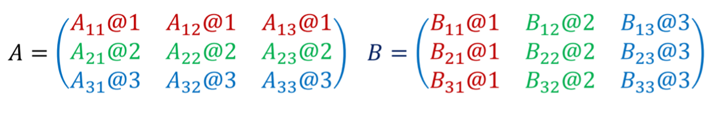
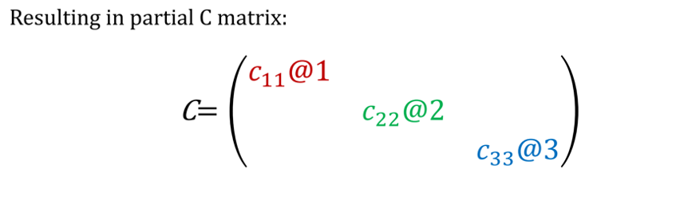
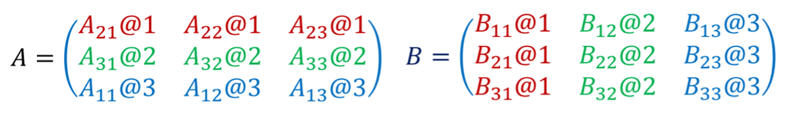
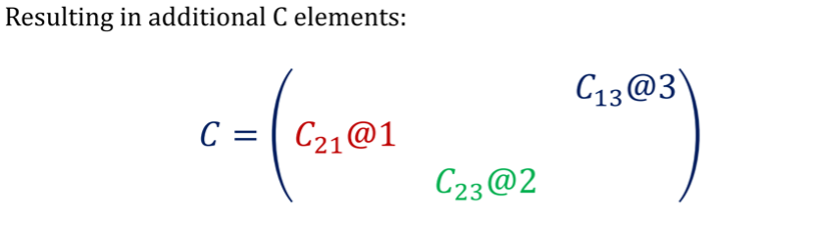

# FastMatMul
## An application of parallel computing and MPI to matrix multiplication.

Summary: `matrix_mul.c` demonstrates a faster way to multiply two square matrices of size $N$ using $P$ cores (where $P=1,2,4,16$). 

## Algorithm Description
We developed a program in C using MPI for parallel implementation of matrix-matrix multiplication. Among the many different available methods, we chose to implement a method with row-partition of matrix $A$ and column-partition of matrix $B$. 

We will be starting with some simple definitions, as well as a description of matrix multiplication. For simplicity, we will assume that we have been given two square matrices with the same size, namely $A,B\in\mathbb{R}^{N\times N}$. Then, the $\left(i,j\right)$-th element of the product $C=AB$ is:

$$c_{i,j}=\sum_{k=0}^{N}a_{ik}b_{kj}$$

This implies that the overall calculation of all $N\times N$ elements of the product matrix has time complexity $O\left(N^3\right)$. This is not a problem for small matrices, but one the size of the matrix increases (e.g., $N>1000$) the calculation becomes very expensive. As a result, we want to parallelize the computation.

First, we split the data across different cores; A is row-partitioned, while B is column-partitioned. In the following example, we use three cores (in our code we prefer powers of 2):

  

Then, we multiply the sub-matrices and add the products in a “dot-product” fashion (even though they are matrices not vectors). The results are the diagonal submatrices.

  

We now permute the submatrix-rows across cores like in the following example:

  

And repeat the same process to get the following elements:

  

We conduct this P times, where P is the number of cores used.

`funcs.h` is imported to `matrix_mul.c`, which demonstrates the algorithm for random matrices. The user has to input $N$ and $P$ as command-line arguments during execution.

## Implementation

### Running this on my personal machine.
After installing MPI and the appropriate compilers you can open a terminal and run `mpicc matrix_mul.c -o mat` and then run the execuatable with `mpirun -np 4 ./mat 16 4` for $N=16$ (the size of the square matrix - number of rows/columns) and $P=4$ (number of cores). Notice that we pass both the command line arguments `4 2`, as well as the flag `-np`. The output includes the matrix product computed serially, the matrix product computed in parallel, as well as the time of the parallel processing.

### Running this on an HPC cluster
We ran this code on SeaWulf, the high-performance computing (HPC) cluster at Stony Brook University. The job scheduling is handled by Slurm, thus I have included my slurm script for most implementations (for the ones up to 28 cores - for more cores, I have to modify the slurm script to use a different queue). For example, when using $P=16$ cores and $N=512$, we have:

`#SBATCH --ntasks-per-node=16`

`#SBATCH --nodes=1`

`#SBATCH -p short-28core`

We don't need to use more than one node, since this parallel job is not too computationally heavy (memory-wise) and it isn't split to that many cores. Later in the script we see `module load mvapich2/gcc12.1/2.3.7`, in which we specify the module which allows us to use the `mpicc` and `mpirun` commands. Finally, `mpicc matrix_mul.c -o mat` and `mpirun ./mat 16 512`.

Notice that the computational time is reduced as the number of cores used increases. For instance, in the HPC cluster in which this code was run (SeaWulf, at Stony Brook University), a $4096 \times 4096$ matrices multiplication takes ~10 minutes when $P=4$, while it only takes ~1.5 minutes when $P=16$. We used 1 node and $P$ Intel Haswell AVX2 CPU cores.

## Analysis

We are analyzing the scalability and speed increase of the algorithm. **More coming soon...**
